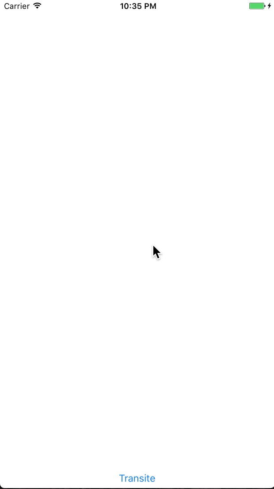

# BACTERIA
**It's framework for easy perform basic custom modal viewcontroller transitions. Current version - 0.5**



## Feature list

* human syntax for transitions for ObjC
* support segues, not only for modal code presentation
* support different transition types (flat, flip, pop, safari)
* support all side modal controller presentation (note: flat extended)
* support scaling for present and dismiss controller views (note: just for flat)
* support auto-reverse functionality(means you can specify only one type for presental/dismissal and the other will be inferred automatically)

## Installation with CocoaPods

[CocoaPods](http://cocoapods.org) is a dependency manager for Objective-C, which automates and simplifies the process of using 3rd-party libraries like Bacteria in your projects. You can install it with the following command:

```bash
$ gem install cocoapods
```

#### Podfile

To integrate Bacteria into your Xcode project using CocoaPods, specify it in your `Podfile`:

```ruby
source 'https://github.com/CocoaPods/Specs.git'
platform :ios, '8.0'

target 'TargetName' do
pod 'Bacteria'
end
```

Then, run the following command:

```bash
$ pod install
```

## How to

Any instruction should be applied to presented controller. You can get it two ways:

1. Create it manually and present
```objective-c
	
```
2. Using segue tracker
```objective-c
- (void)prepareForSegue:(UIStoryboardSegue *)segue sender:(id)sender {
    //get presented controller
    BCTPresentedViewController *presented = segue.destinationViewController;
    
    //bacteria configuration
    presented.
    presentTransition(BCTTransitionFlip).
    fromDirection(BCTDirectionTop).
    dismissTransition(BCTTransitionPopRadial).
    popTo(self.testButton).
    withDuration(0.45f);
}
```

## Functionality overview

1. `withDuration(XXX)` - use this to specify duration for transition. XXX - float value in seconds. Applied both for presentation and dismissal
2. 

## Enum types

## TODO Section

#### Version 0.6
- [ ] Add functionality to retain view within container view. Tip: I should use snapshot, not `addSubview:`
- [ ] Add separate duration for present / dismiss
- [ ] Add transitions for viewControllers in navigation stack
- [ ] Add Swift cover file for convenient syntax. Initially it is designated for ObjC users

#### Version 0.7
- [ ] Add interactivity. Users should easily embed transitions in gestures
- [ ] Add support for pop initial point depending on user finger location
- [ ] Add spring values for all kind of transitions

#### Version 0.8
- [ ] Add support for background color of container for transitions
- [ ] Add blur for background container for transitions
- [ ] Add transitions for collections

#### Version 0.9
- [ ] Review whole library for refactor process

## Historical notes

Bacteria initially stands for **B**eautiful **A**nimation **C**ontroller **T**ransition. After some time it was renamed to Bacteria, for short and convenience. In other meaning, it can stands for **Ba**sic **C**ontroller **T**ransitions.

## Contributors

- [Igor Kislyuk](https://github.com/igorkislyuk)

## License

MIT License. See LICENSE file for details.